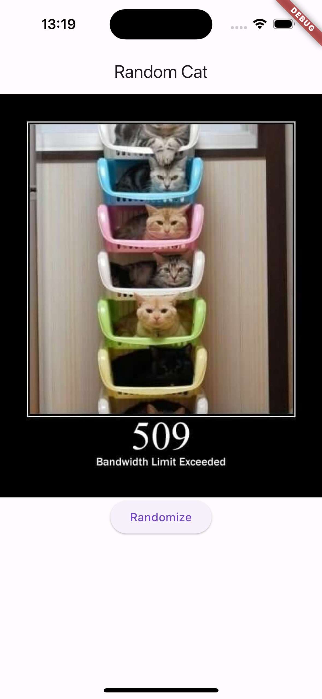
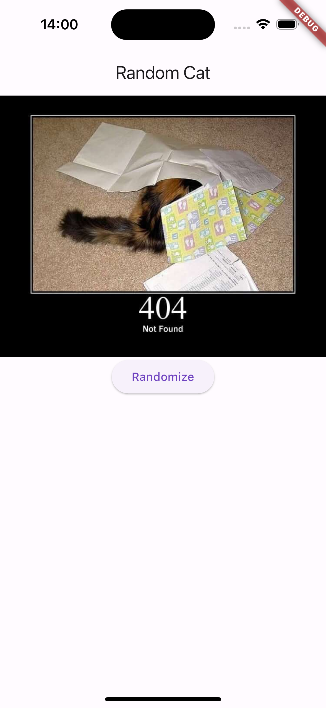
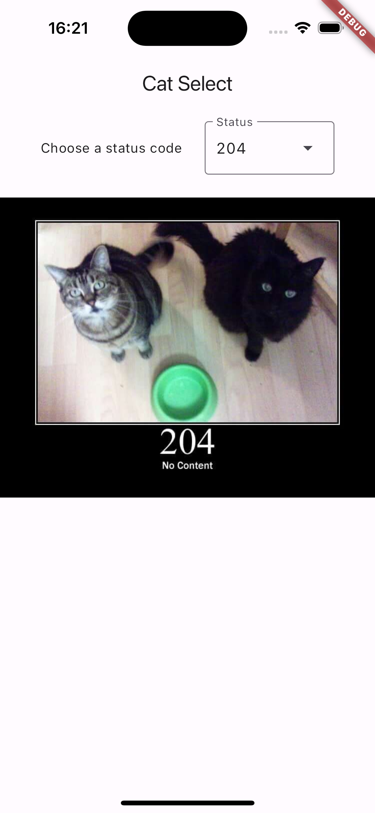
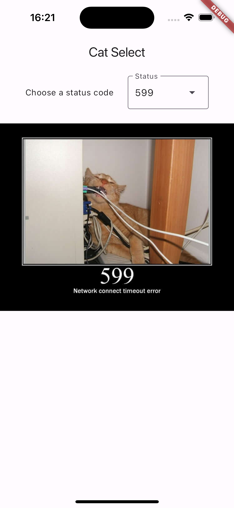
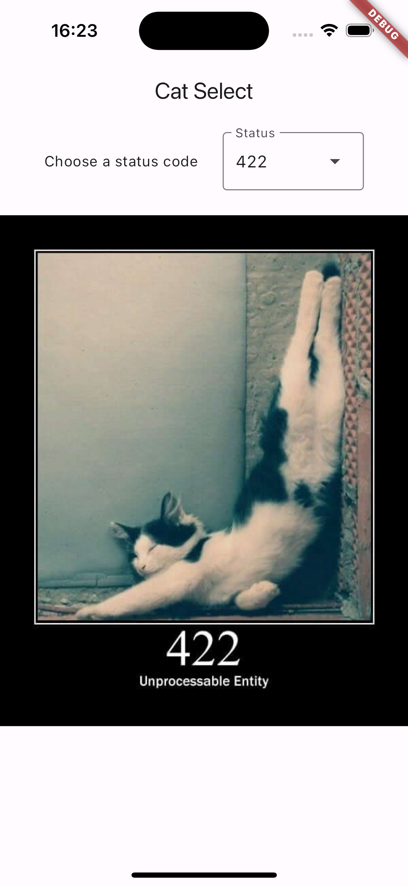

# http_cat_flutter

A new Flutter project.

## Getting Started

This project is using [Http Cat API](https://http.cat). This is the funniest api i've ever used. Basically you send a status code and API returns you a cat image xd

## Screenshots

 

